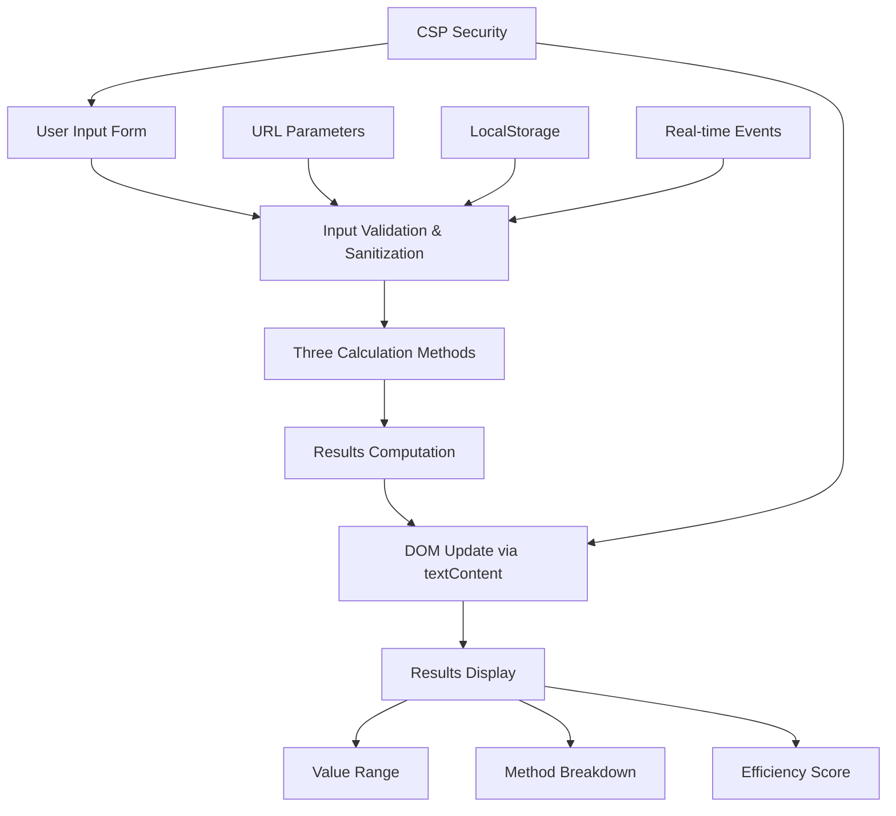

# CDC Voucher Valuation Tool - Plan Summary & Approval Request

## Project Overview
A purely client-side web tool for Singaporean residents to calculate the true economic value of CDC vouchers based on personal spending habits, with strict privacy and security requirements.

## Key Decisions Made

### 1. Tech Stack
- **Vanilla JavaScript** (no frameworks) - for simplicity and zero dependencies
- **Pure CSS** (no Tailwind) - for minimal footprint
- **HTML5** with CSP security headers

### 2. Feature Set
- ✅ **Core Calculation**: All 3 methods from PRD (WTP, Denomination Loss, Incremental Spending)
- ✅ **URL Parameter Support**: Pre-fill form via query parameters with security validation
- ✅ **LocalStorage Integration**: Save/load user inputs automatically
- ✅ **Real-time Updates**: Calculations update as user types (with debouncing)
- ✅ **Mobile-First Responsive Design**: Works on all screen sizes

### 3. Security Implementation
- Content Security Policy (CSP) meta tag
- Input sanitization and validation
- DOM manipulation via `textContent` only (no `innerHTML`)
- URL parameter allowlisting
- localStorage data validation

### 4. Default Values (Sensible defaults for Singaporean households)
- Voucher Amount: $300
- Voucher Denomination: $10
- Supermarket Avg Spend: $80 (4 visits)
- Heartland Avg Spend: $30 (6 visits)
- WTP Percentage: 70%

## Architecture Diagram



## File Structure
```
CDC Value For You/
├── index.html          # Main HTML with CSP meta tag
├── styles.css          # Pure CSS with mobile-first design
├── app.js              # Vanilla JS with all logic
└── plans/              # Planning documents
    ├── file_structure.md
    ├── implementation_plan.md
    └── summary_and_approval.md (this file)
```

## Implementation Timeline (Logical Order)
1. **Phase 1**: Basic HTML structure with form and CSP
2. **Phase 2**: CSS styling for mobile responsiveness
3. **Phase 3**: Core calculation logic (3 methods)
4. **Phase 4**: Input validation and error handling
5. **Phase 5**: URL parameter and localStorage integration
6. **Phase 6**: Real-time updates and UX polish
7. **Phase 7**: Security hardening and testing

## Testing Coverage
- All PRD test cases (including XSS attempts)
- Edge cases (zero values, negative inputs)
- Mobile responsiveness
- URL parameter injection attempts
- Calculation accuracy verification

## Request for Approval

**Please review the plan and confirm if you'd like me to proceed with code generation.**

### Key Questions for Final Confirmation:
1. Are the default values appropriate?
2. Should we include any additional features not mentioned?
3. Are there any specific design preferences (colors, fonts)?
4. Should we implement a "Share Results" feature (generates URL)?

### Suggested Next Steps:
- Switch to **Code mode** to implement the solution
- Generate the three core files (`index.html`, `styles.css`, `app.js`)
- Test functionality against PRD requirements
- Deploy to a local server for verification

---

## Approval Options

Please indicate your preference:

1. **Approve and proceed with code generation** - I'll switch to Code mode and implement the full solution
2. **Make minor adjustments first** - Specify what changes you'd like
3. **Review specific components** - Let's discuss any concerns before proceeding
4. **Provide additional requirements** - Add more features or constraints